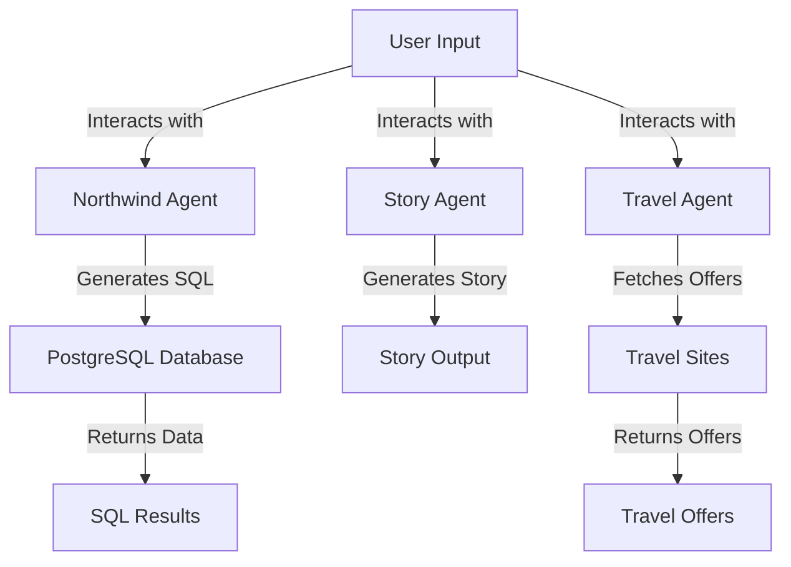

# AI_FirstApp Summary

Generated from the `main` branch of `mosheProj/AI_FirstApp`.

## Background

The **AI_FirstApp** repository is designed to showcase multiple AI-driven applications, leveraging the LangChain framework for various tasks. The project includes three main agents: a Northwind SQL generation agent, a children's story generator, and a travel deals finder. The stack primarily consists of Node.js, React, and PostgreSQL, with Docker for containerization.

Key modules include:
- **Northwind Agent**: Generates SQL queries based on user input related to the Northwind database.
- **Story Agent**: Creates children's stories based on user-defined parameters.
- **Travel Agent**: Searches for hotel offers based on user-specified travel details.

The repository is organized into separate directories for each agent, with shared configurations and utilities. Each agent has its own CLI and server for interaction, and the project supports both interactive and one-shot command-line usage.

## System Diagram

## Detailed Flows

The repository features several important runtime flows:

1. **Northwind Agent**:
   - Entry Point: `src/agent/cli.js` or `src/server.js`.
   - User inputs a natural language question regarding the Northwind database.
   - The agent processes the input, generates a SQL query, and executes it against the PostgreSQL database.
   - Results are returned to the user in a structured format.

2. **Story Agent**:
   - Entry Point: `src/cli.js` or `src/server.js`.
   - Users provide a subject and options for the story (e.g., type, length).
   - The agent generates a story using the OpenRouter API and returns it to the user.

3. **Travel Agent**:
   - Entry Point: `src/cli.js` or `src/server.js`.
   - Users specify travel details (location, dates, adults).
   - The agent queries travel sites for hotel offers, processes the results, and returns a list of offers sorted by price.

Data movement occurs through API calls to external services (OpenRouter for story generation and travel offers) and database queries for the Northwind agent. Each agent has its own validation and error handling mechanisms to ensure robust user interactions.

## Analysis Notes

- Files analyzed: 60
- Bytes analyzed: 122902
- Files skipped because of size, type, ignore rules, or configured limits: 67
